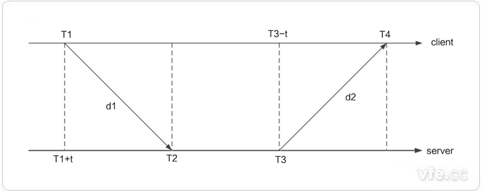
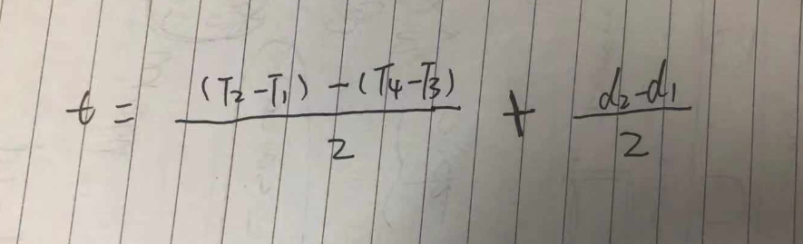

# ntp 协议

ntp 协议是一种利用网络从权威的时间服务器将精确的时间同步到本地计算机的协议。网络上有权威的专门用来维护时间的服务器（比如中国有国家授时中心），所有的计算机只需要以这个时间为准就可以实现同步了。

ntp 协议是 client/server 模式，客户端 A 先向服务器 B 发送一个 ntp 包，这个包里包含了离开客户端 A 的时间戳 `T1`，当服务器 B 接收到这个包的时候，向客户端 A 应答一个包，这个包里面包含了服务端收到客户端包的时间戳 `T2`、应答包离开的时间 `T3`，客户端 A 收到这个包的时候，记录下收到包的时间 `T4`。

整个过程如下图:

定义下面几个变量：

- t：两台机器之间的时间偏差，即客户端 A 时间 + t = 服务器 B 时间。
- d1：客户端 A 发送包到服务器 B 的网络延时。
- d2：服务器 B 应答包到客户端 A 的网络延时。
- d：包往返的总延时，即 `d = d1 + d2`

先以客户端的角度来看：客户端 A 认为 `T2=T1+t+d1`，即客户端 A 时间 + t + 网络延时 = 服务端收到包的时间。

再从服务端的角度来看：服务器 B 认为 `T4=T3-t+d2`，即服务端 B 时间 - t + 网络延时 = 客户端收到包的时间。

解一下上面方程可以得到如下的算式：

通过算式可以看出，时间偏差和 T1、T2,、T3、T4 有关系，这几个值都可以获取到，同时还跟 d1 和 d2 有关系。

假设 d1 = d2, 即包往返的网络延时一样长，那么就可以直接算出时间偏差了，可以根据这个偏差来修正客户端的时间。

假设 d1 != d2，由于 d1 和 d2 的取值范围是 (0，d)，所以误差范围就是 ±d/2。也就是说一个包的往返延迟是 1s ，那么最大误差也就是 ±0.5s。

当然还有些其他的影响因素：

- 客户端与服务端上的 ntp 软件记录的时间戳是否准确（由于 cpu 时间片的原因，软件记录的时间和包真实到达的硬件时间肯定不会完全一致）。

- 计算机石英晶体振荡频率的稳定性（主要受温度影响），计算机硬件时间本身就是通过振荡频率来计算的，频率忽快忽慢，计算机的时间准确度就会有影响。

这两点对我们来说几乎可以忽略不计。

## 参考资料

- [ntp](https://blog.csdn.net/hhcjb/article/details/84940823)
